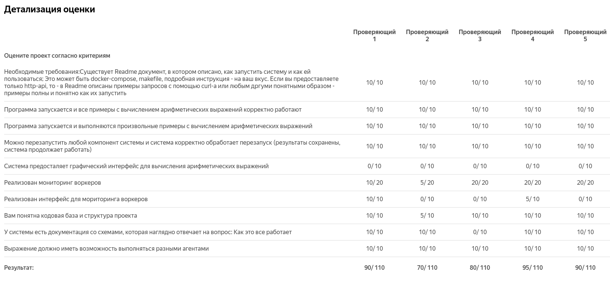
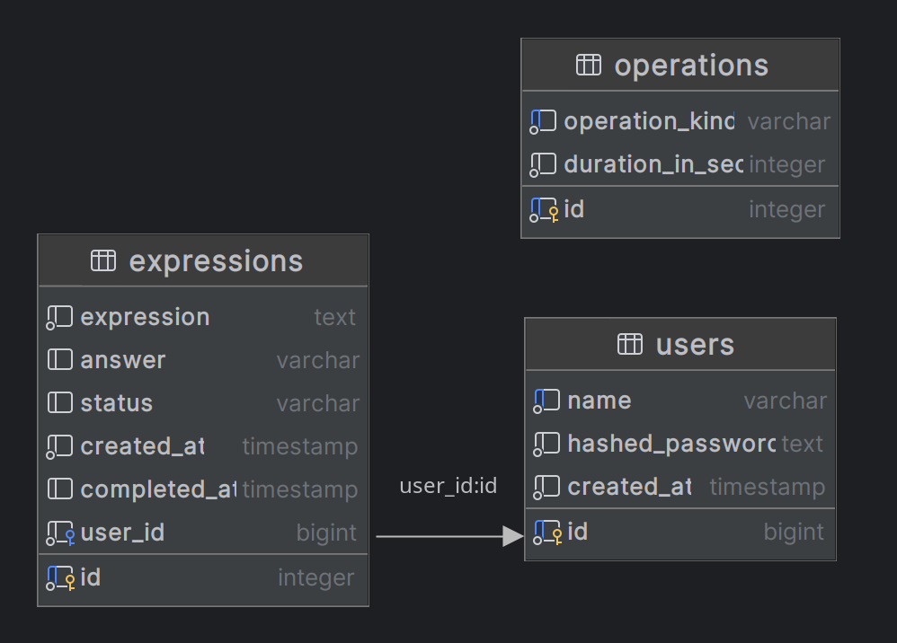
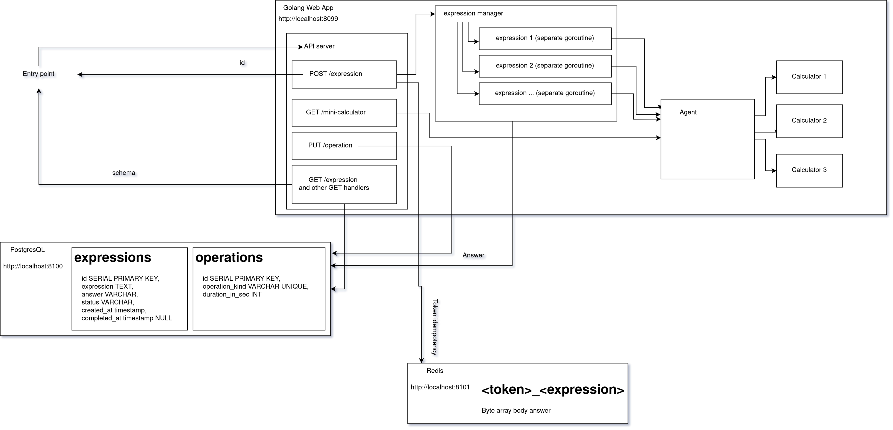

# Distributed-Arithmetic-Expression-Calculator
D-A-E-C

Project from Yandex Lyceum Course - Programming in Go

Score: 90/110


## Description

The user wants to count arithmetic expressions. 
He enters the line `2 + 2 * 2` and he wants to get 6 in response.
Therefore, the option in which the user makes a http request and receives the result as a response is impossible. Moreover, the calculation of each such operation in our "alternative reality" takes up "gigantic" computing power. 

Full description: [link](docs/version_1/tech_specification_RU_1.md)


Start point: http://localhost:8099/
## Run project: 
1) install [docker engine](https://docs.docker.com/engine/install/) and [docker compose](https://docs.docker.com/compose/install/)
2) `git clone https://github.com/BaizhumanovAlisher/Distributed-Arithmetic-Expression-Calculator.git`
3) `cd Distributed-Arithmetic-Expression-Calculator`
4) `docker compose -f docker-compose.yml -p distributed_calculator up -d`

# Example:
POST `http://localhost:8099/expression`
```json
{
    "expression": "((2*(3+4))/5)+(6-7)"
}
```

```json
{
  "id": 32
}
```

GET `http://localhost:8099/expression/32`
```json
{
    "id": 32,
    "expression": "((2*(3+4))/5)+(6-7)",
    "answer": "1.8",
    "status": "completed",
    "createdAt": "2024-02-17T19:13:20.214215Z",
    "completedAt": "2024-02-17T19:13:45.234002Z"
}
```

## You can get error like: 

`Error response from daemon: Ports are not available: exposing port TCP 0.0.0.0:5673 -> 0.0.0.0:0: listen tcp 0.0.0.0:5673: bind: address already in use`

In this case you should change to free port in [docker-compose](docker-compose.yml)

Change only exposed ports and in config file

Example:
- From:
```yaml
  postgres:
    container_name: daec_postgresql
    image: postgres
    ports:
      - "5432:5432"
```
- To:
```yaml
  postgres:
    container_name: daec_postgresql
    image: postgres
    ports:
      - "8100:5432"
```

## Tech specification:
- [specifications 1](docs/version_1/tech_specification_RU_1.md) and [specifications 2](docs/version_2/tech_specification_RU_2.md)
- [criteria](docs/version_1/evaluation_criteria.md) 

## No Front-end

Use OpenAPI in [file](api/api.yaml)

You can use postman. [Postman file](docs/postman.json). [Postman download](https://www.postman.com/downloads/)

# Rules for expression

1) expression should not contain extra symbols
2) brackets should be correct

# Token idempotency
- Header: `X-Idempotency-Token`
- It is used in `/expression` POST HTTP method
- It consists of token from user, separator and expression: "<"user token idempotency">__<"expression">". Example: `dkskdhen392h__2+3*4`
- It is lived 600s. It is described in [config.yaml](api_server/config.yaml)
- **If header is null, token will not be used**
- No caching in `500` http code

# Authorization
- Header: `Authorization: Bearer` [link](https://apidog.com/articles/what-is-bearer-token/)
- All handlers require authorization except `/sign_up` and `/login`
- Length of `name` and `password` should be longer than 7

# Ports
- api_server: http://localhost:8099
- postgresql: http://localhost:8100
- redis: http://localhost:8101
- auth_service: http://localhost:8102

# Database diagram


# Scheme
